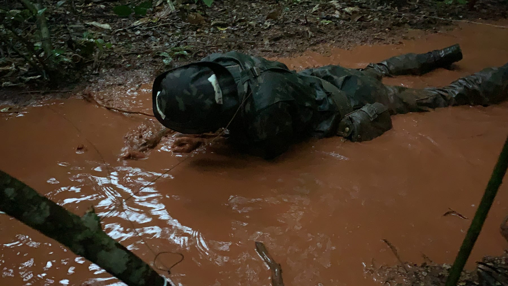
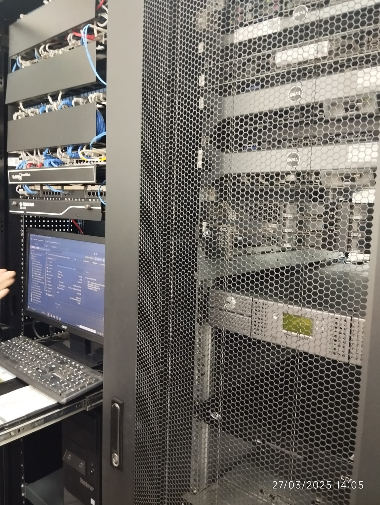

```sh
$ whoami
nick
```

Tudo começou lá em 2017, quando decidi entrar para o Exército. Não passava nada
de tecnologia pela minha cabeça. Eu estava mesmo era interessado em produção
musical e em um dia virar um novo Hans Zimmer ou Ludwig Göransson. Fã aqui 👋

## Sem caminho fácil



Eu estava perdido na vida, não sabia o que fazer. O Exército apareceu como
solução rápida para as minhas dúvidas. "Vamos ver no que dá, será que eu aguento
o treinamento e a privação de sono? Será que eu passo pela semana do inferno?"

Aprendi muita coisa. Umas eu aprendi do jeito difícil, outras eu simplesmente
sabia que tinha que acelerar, senão ia dar cadeia.

Aos 19 anos, como 1º Tenente, eu era o comandante do pelotão de comunicações.
Foi uma época boa, tive que amadurecer rápido. Mas também sentia falta da
família — estava longe de casa, em outro estado, e não conhecia ninguém.

Passei 5 anos de serviço militar temporário correndo atrás da música. Não deu
muito certo e demorei para desistir. Música não era para ser trabalho, era para
ser hobby, e eu estava correndo atrás da carreira errada.

## O playground

Então, depois de um tempo, decidi focar em programação e fiz alguns cursos
online. Em 2023 fui para a Seção de TI e, de repente, eu tinha uma pequena
infraestrutura inteira como playground. Sete servidores Dell PowerEdge, dois
NAS, firewalls Cisco e Proxmox rodando várias máquinas virtuais.



Aprendi muito com o meu time e brincamos bastante com projetos open source.
[Docker](https://www.docker.com/) e [Linuxserver](https://www.linuxserver.io/)
ajudaram demais a subir soluções simples como
[Uptime Kuma](https://uptimekuma.co/), [Gitea](https://about.gitea.com/) e
[Nextcloud](https://nextcloud.com/), e trabalhamos com segurança de rede usando
[Wireshark](https://www.wireshark.org/) e
[Security Onion](https://securityonionsolutions.com/).

Aí começamos a construir as nossas próprias. Um sistema de chamados integrado ao
Telegram. Um app para controlar e registrar as entradas e saídas do batalhão. E
por fim reconstruímos a intranet em Joomla usando Angular, Nginx, Strapi e
Node.js.

Essa é a parte que ficou. Eu construía os sistemas e depois era eu quem tinha que
mantê-los de pé, que é um ciclo de feedback que a maioria dos engenheiros nunca
recebe.

## O que eu faço hoje

Engenheiro de software full stack em São Paulo. Três anos e pouco de aplicações
web, apps mobile e todo tipo de backend — *TypeScript, Python, Bash, C# e
Flutter* são algumas das linguagens que já usei. Aplicações que construí atendem
mais de 10.000 usuários ativos por dia.

Hoje isso se divide em duas frentes. Em tempo integral estou em dados: pipelines
de analytics em saúde com BigQuery, Dataform e Python, e os dashboards em que
times clínicos e de negócio se apoiam para decidir. Em paralelo, tem algumas
startups com quem eu trabalho.

Português é minha primeira língua, inglês a segunda. Estudei Análise e
Desenvolvimento de Sistemas na Descomplica.

Então — `whoami`? Essa é a resposta longa. A curta continua sendo `nick`, e estou
aberto a novas oportunidades. E-mail é o caminho mais rápido, ou pega o
[currículo](/pt-br/resume) se você quiser tudo isso comprimido em uma página.
